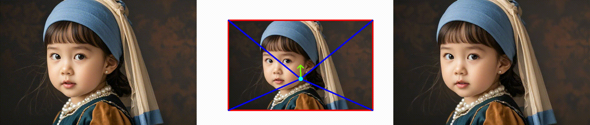
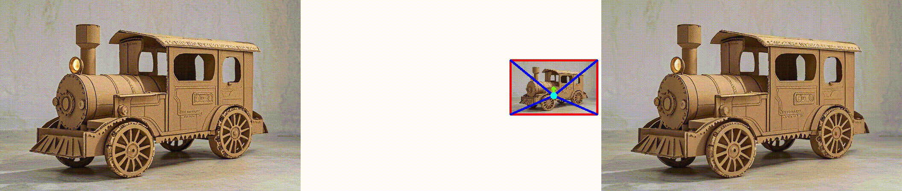
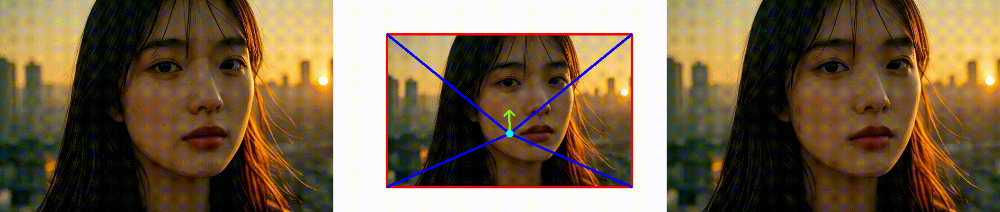

## Anonymous repository for paper submission: ICLR 2025, paper ID 1844

This repository contains visual results from our study, showcased in sequential animated GIFs. 

For each sample, we manually set the camera movement and adjust it to a suitable motion strength value. 

The first column is the original input image, the second column is the camera motion trajectory, and the third column is the generated result.

<table>
  <tr>
    <th width=34% style="text-align:center">Input Image</th>
    <th width=32% style="text-align:center">Camera Movement</th>
    <th width=34% style="text-align:center">Result</th>
  </tr>
  <tr>
    <td colspan="3" ></td>
  </tr>
  <tr>
    <td colspan="3"></td>
  </tr>
  <tr>
    <td colspan="3"></td>
  </tr>
  <tr>
    <td colspan="3"></td>
  </tr>
  <tr>
    <td colspan="3"></td>
  </tr>
  <tr>
    <td colspan="3"></td>
  </tr>
  <tr>
    <td colspan="3"></td>
  </tr>
  <tr>
    <td colspan="3"></td>
  </tr>
  <tr>
    <td colspan="3"></td>
  </tr>
  <tr>
    <td colspan="3"></td>
  </tr>
  <tr>
    <td colspan="3"></td>
  </tr>
  <tr>
    <td colspan="3"></td>
  </tr>
  <tr>
    <td colspan="3"></td>
  </tr>
  <tr>
    <td colspan="3"></td>
  </tr>
  <tr>
    <td colspan="3"></td>
  </tr>
  <tr>
    <td colspan="3"></td>
  </tr>
  <tr>
    <td colspan="3"></td>
  </tr>
  <tr>
    <td colspan="3"></td>
  </tr>
</table>
