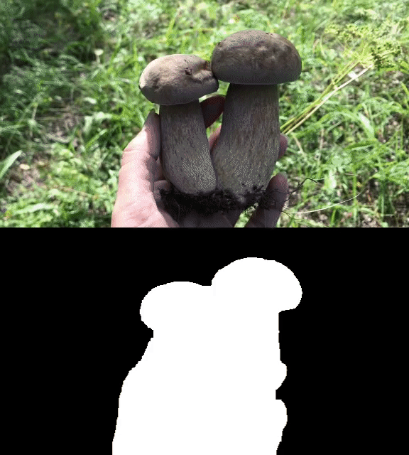

## Anonymous repository for paper submission: ICLR 2025, paper ID 1844

# Rebuttal--Supplementary Visual Results

## Pixel-level Control & Visual Comparisons

We show our camera control results with ground truth preview here, which demonstrates our pixel-level control capabilities.

We also list the results of the comparing methods for the qualitative comparison. We can observe that our control precision is significantly higher than that of comparative methods.

<table>
  <tr>
    <th width=25% style="text-align:center">Input & GT Preview</th>
    <th width=25% style="text-align:center">CameraCtrl</th>
    <th width=25% style="text-align:center">MotionCtrl</th>
    <th width=25% style="text-align:center">Ours</th>
  </tr>
  <tr>
    <td colspan="4" ></td>
  </tr>
  <tr>
    <td colspan="4" ></td>
  </tr>
  <tr>
    <td colspan="4" ></td>
  </tr>
  <tr>
    <td colspan="4" ></td>
  </tr>
  <tr>
    <td colspan="4" ></td>
  </tr>
  <tr>
    <td colspan="4" ></td>
  </tr>
</table>

## Combinations of multiple camera movements

The following samples contain combinations of multiple camera movements.

<table>
  <tr>
    <th width=20% style="text-align:center">Camera Mode</th>
    <th width=20% style="text-align:center">Input & GT Preview</th>
    <th width=20% style="text-align:center">CameraCtrl</th>
    <th width=20% style="text-align:center">MotionCtrl</th>
    <th width=20% style="text-align:center">Ours</th>
  </tr>
  <tr>
    <th width=20% style="text-align:center">move left + pan right + move up + tilt down</th>
    <td colspan="4" ></td>
  </tr>
  <tr>
    <th width=20% style="text-align:center">move left + pan right</th>
    <td colspan="4" ></td>
  </tr>
  <tr>
    <th width=20% style="text-align:center">rotate + move up + tilt down</th>
    <td colspan="4" ></td>
  </tr>
  <tr>
    <th width=20% style="text-align:center">rotate + zoom in</th>
    <td colspan="4" ></td>
  </tr>
  <tr>
    <th width=20% style="text-align:center">rotate + pan right</th>
    <td colspan="4" ></td>
  </tr>
</table>

## Multiple dynamic objects

The following samples contain multiple dynamic objects, where our method can still achieve precise control and natural dynamics.

<table>
  <tr>
    <th width=25% style="text-align:center">Input & GT Preview</th>
    <th width=25% style="text-align:center">CameraCtrl</th>
    <th width=25% style="text-align:center">MotionCtrl</th>
    <th width=25% style="text-align:center">Ours</th>
  </tr>
  <tr>
    <td colspan="4" ></td>
  </tr>
  <tr>
    <td colspan="4" ></td>
  </tr>
  <tr>
    <td colspan="4" ></td>
  </tr>
  <tr>
    <td colspan="4" ></td>
  </tr>
  <tr>
    <td colspan="4" ></td>
  </tr>
</table>

## Multiple motion strength

We show the results under different motion strength. It is evident that as the motion strength increases, the amplitude of the motions enlarged and shows a direct positive correlation with the set values of motion strength.

<table>
  <tr>
    <th width=25% style="text-align:center">Input & GT Preview</th>
    <th width=25% style="text-align:center">MS=0</th>
    <th width=25% style="text-align:center">MS=200</th>
    <th width=25% style="text-align:center">MS=600</th>
  </tr>
  <tr>
    <td colspan="4" ></td>
  </tr>
  <tr>
    <td colspan="4" ></td>
  </tr>
  <tr>
    <td colspan="4" ></td>
  </tr>
  <tr>
    <td colspan="4" ></td>
  </tr>
  <tr>
    <td colspan="4" ></td>
  </tr>
  <tr>
    <td colspan="4" ></td>
  </tr>
  <tr>
    <td colspan="4" ></td>
  </tr>
  <tr>
    <td colspan="4" ></td>
  </tr>
  <tr>
    <td colspan="4" ></td>
  </tr>
</table>

## Experiment on another base model

We present some preliminary results on another base model. Although we are not yet able to present very detailed experimental results (due to limited time), the current results should be sufficient to demonstrate the applicability of our method to any base model.

<table>
  <tr>
    <th width=25% style="text-align:center">Pan</th>
    <th width=25% style="text-align:center">Zoom</th>
    <th width=25% style="text-align:center">Tilt</th>
    <th width=25% style="text-align:center">Rotate</th>
  </tr>
  <tr>
    <td colspan="1" ></td>
    <td colspan="1" ></td>
    <td colspan="1" ></td>
    <td colspan="1" ></td>
  </tr>
  <tr>
    <td colspan="1" ></td>
    <td colspan="1" ></td>
    <td colspan="1" ></td>
    <td colspan="1" ></td>
  </tr>
</table>

## Visualization of dynamic mask

Some representative examples are illustrated below. Our method successfully classifies subjects exhibiting substantial motion into dynamic segments with a high degree of accuracy.

<table>
  <tr>
    <td colspan="1" ></td>
    <td colspan="1" ></td>
    <td colspan="1" ></td>
    <td colspan="1" ></td>
  </tr>
  <tr>
    <td colspan="1" ></td>
    <td colspan="1" ></td>
    <td colspan="1" ></td>
    <td colspan="1" ></td>
  </tr>
</table>

As suggested by the reviewer, we specifically selected some examples featuring lake/sea/water, which are showcased below:

<table>
  <tr>
    <td colspan="1" ></td>
    <td colspan="1" ></td>
    <td colspan="1" ></td>
    <td colspan="1" ></td>
  </tr>
</table>

